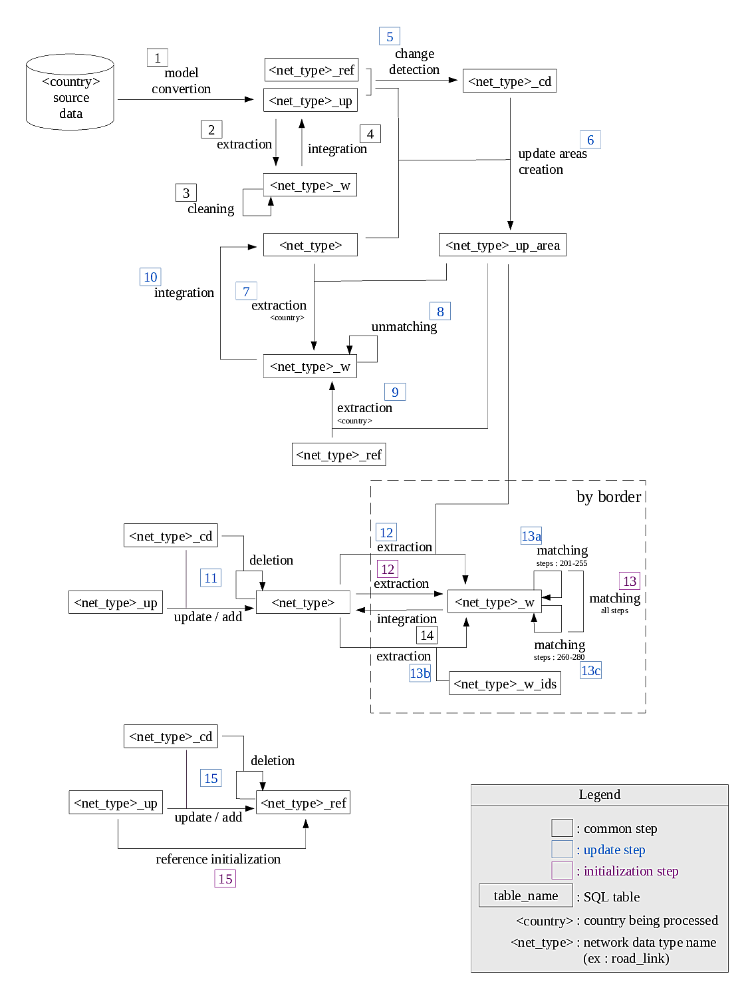

# Description du processus pour l'intégration de nouvelles données de type réseau

# Introduction

Ce document a pour objectif de décrire de manière macroscopique le processus d'intégration des données d'un pays dans la base de données OME2 que ce soit pour une initialisation (première intégration) ou une mise à jour.

Le processus d'écrit ici est spécifique aux données de type réseau qui sont constituées d'objet de type géométrique linéaire formant une structure topologique cohérente.
Dans le cadre du projet OME2 les jeux de données répondant à cette définition sont les suivants:
- le réseau routier : table _road_link_ du thème transport (tn)
- le réseau ferré : table _railway_link_ du thème transport (tn)
- le réseau hydrographique : table _watercourse_link_ du thème hydrographie (hy)

# Description du processus

Le schéma ci-après détail le processus complet d'intégration des données d'un pays dans la base OME2.
Quel que soit le format de livraison adopté par producteur de données, celles-ci sont injectées dans une base de données PostGIS. C'est cette base de données qui constitue la donnée source du processus.



## Déroulement du processus

Pour décrire le déroulement du processus on se place dans le cas de l'intégration des données *<net_type>* du pays *<ome2land>* dont le code pays est **om**
le jeux de données *<net_type>* appartient au thème *<theme>* qui à pour code **th**


### Etape 0 : préparation du processus

Il faut supprimer de la table de mise à jour *<net_type>_up* si elle existe.

### Etape 1 : convertion de modèle

Cette étape consiste à convertir les données depuis leur modèle national d'origine vers le modèle OME2.
Dans le cas d'une première intégration des donnés du pays *<ome2land>* l'opérateur chargé de la réalisation de cette étape devra écrire l'ensemble des fichiers de configuration d'écrivant les opérations de convertion pour chaque champ.
Dans le cas d'une mise à jour l'opérateur devra veillé à ce que le modèle national n'a pas évolué depuis la dernière intégration et, le cas échéant, réaliser les adaptations nécessaires.
Les fichiers de configuration constituent le coeur du moteur de convertion.
La table cible est la table de mise à jour *<net_type>_up*.

#### outil utilisé

[data-model-transformer](https://github.com/openmapsforeurope2/data-model-transformer)

#### configuration
Le fichier de configuration conf.json doit être renseigné en indiquant les paramètres de connexion aux bases source et cible, ainsi que les codes du pays et du thème traités.
Le fichier ce présente sous la forme suivante:
```
{
    "country":"om",
    "theme":"th",
    "output":"",
    "source_db":{
        "host":"",
        "port":"",
        "name":"",
        "user":"",
        "pwd":"",
        "schema": ""
    },
    "target_db":{
        "host":"",
        "port":"",
        "name":"",
        "user":"",
        "pwd":"",
        "schema": ""
    }
}
```

#### commande
```
python3 transform.py -c conf.json
```

### Etapes 2,3 et 4 : nettoyage de données

On procéde ici au nettoyage des données dans la table de mise à jour.
Cela consiste à supprimer les objets situés à l'extérieur de leur pays et dont la distance à la frontière dépasse un certain seuil.

Cette phase du processus se déroule en trois étapes :
- étape 2) extraction dans la table de travail *<net_type>_w* des données situées autour de toutes les frontières du pays *<ome2land>*
- étape 3) nettoyage des données dans la table de travail.
- étape 4) intégration des modifications dans la table de mise à jour *<net_type>_up*

#### outil utilisé

[data-tools](https://github.com/openmapsforeurope2/data-tools)

#### configuration

Dans le fichier db_conf.json doivent être renseigné le paramètres de connection à la base de donnée OME2.
<br>
Dans le fichier conf.json il faut veiller à ce que les différents schéma soient en cohérence avec la structure de la base OME2.
Voici, par exemple, à quoi peut ressembler la configuration des schémas pour le thème <theme>
```
{
    ...
    "data": {
        ...
        "themes": {
            "th": {
                "schema": "prod",
                "h_schema": "prod",
                "w_schema": "work",
                "u_schema": "work",
                "r_schema": "ref",
                "tables": [
                    "road_link",
                    ...
```

#### commandes

Voici l'enchainement des trois commandes qui constituent la phase de nettoyage:

- étape 2)
```
python3 border_extract.py -c conf.json -T th -t <net_type> -d 4000 om '#'
```
- étape 3)
```
python3 clean.py -c conf.json -d 5 -T th -t <net_type> om
```
- étape 4)
```
python3 integrate.py -c conf.json -T th -t <net_type> -s 10
```

### Etape 5 : détection de changements

Cette étape, à lancer dans le cas d'une mise à jour, permet de calculer les différences sémantiques et géométriques entre deux versions d'un même jeux de données.
Les deux tables à comparer sont :
- *<net_type>_ref* : la table de référence dans laquelle est stockée la dernière version du jeux de données qui a été intégré.
- *<net_type>_up* : la table de mise à jour contenant la nouvelle version du jeux de données que l'on souhaite intégrer.

En guise de résultat cette étape donne lieu à la création de la table *<net_type>_cd* dans laquelle sont enregistrées toutes les différences : suppressions, ajouts, modifications.

Parmis les informations contenue dans la table résultat, on trouve:
- l'identifiant dans la table de référence
- l'identifiant dans la table de mise à jour
- un indicateur mentionnant si la différence est de nature géométrique
- un indicateur mentionnant si la différence est de nature sémantique
- un indicateur mentionnant si la différence est de nature sémantique et impactante pour le processus de raccordement aux frontières à venir

#### outil utilisé

[change_detection](https://github.com/openmapsforeurope2/change_detection)

#### configuration

Dans le fichier db_conf.json doivent être renseigné le paramètres de connection à la base de donnée OME2.
<br>
Dans le fichier theme_parameters.ini, on a parmis le paramètres de configuration notables :
- un seuil de détection d'un modofication géométrique
- la taille des dalles (le calcul de détection de changement est réalisé selon une tesselation)
- la liste des champs à ignorer pour la détection de changement sémantique
- la liste des champs impactants le processus de raccordement aux frontières

#### commande
```
change_detection --c epg_parameters.ini --op diff --T th --f <net_type> --cc om
```